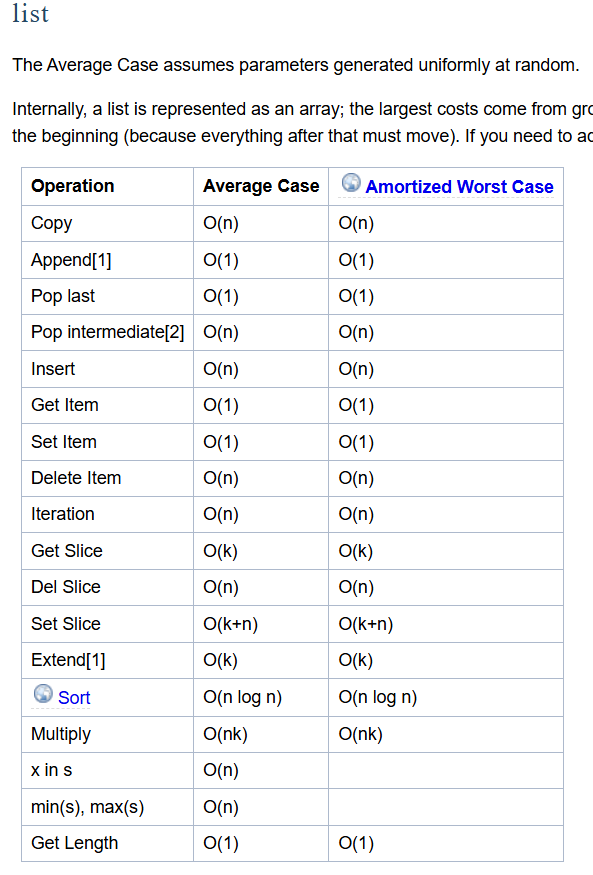
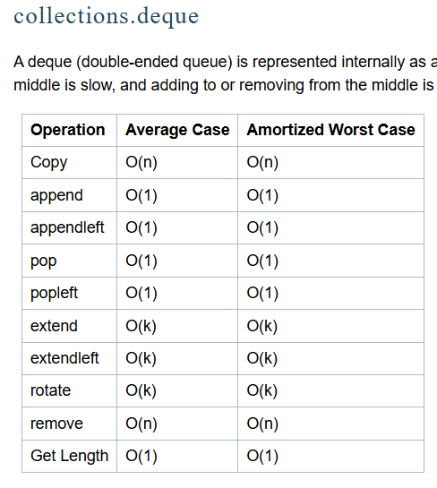

# LestaTestTask
Тестовое задание для вакансии "Стажер-программист игровой логики (Intern Game Logic Programmer)"

Задание 1.
1) Плюсы и минусы использования деления по модулю:
    Плюсы:
        - Понятность: этот алгоритм легко читается и понимается даже теми людьми, кто только начал программировать.
    Минусы:
        - Операции деления по модулю (любые арифметические действия) медленней работают по сравнению с битовыми операциями. Это особенно важно, когда на программу идет большая нагрузка (огромные числа подаются в функцию либо же сама функция очень часто вызывается).
2) Плюсы и минусы использования битовых операций:
    Плюсы:
        - Битовые операции выполняются быстрее. Тем более в моем приведенном коде проверяется лишь последний бит числа, все остальные биты числа маскируются.
        - Эффективность: не требуется много ресурсов для выполнения битовой операции.
    Минусы:
        - Не очевидная реализация: некоторые люди, особенно на ранних этапах программирования, смогут понять, что делает функция, лишь оттолкнувшись от её названия, или же при запуске тестов. Многие привыкли писать 'value % 2 == 0', а такая реализация может показаться им странной.
        - Если человек не знает как работают битовые операции, то ему не до конца будет ясно, как конкретно работает функция и что означает запись 'value & 1'.

Задание 2.
1) Плюсы и минусы класса FIFObyList:
    Плюсы:
        - Полностью ручная реализация, благодаря которой можно понять как устроен и работает FIFO.
        - Не требуется импорт дополнительных зависимостей.
    Минусы:
        - Требуется больше кода для реализации и управления индексами tail и head (отсюда возможные ошибки при переопределении индексов).
        - Реализации сложнее.
2) Плюсы и минусы класса FIFObyDeque:
    Плюсы:
        - Меньше кода, ввиду того, что deque сам обрабатывает цикличность - снижается риск допустить ошибки.
        - Самая главная особенность deque, что эта структура данных оптимизирована для вставки и удаляения с обоих концов, что делает его быстрым и эффективным в качестве реализации FIFO.
        - Для deque определены удобные методы, которые в свою очередь подходят для FIFO.
    Минусы:
        - Менее очевидно, как работает циклический буфер.
        - Требуется импорт бибилотеки (хоть она и стандартная).
На счет быстродействия: пользуясь официальной документацией, можно заметить, что те методы, которые были мною реализованы (добавление в конец, извлечение элемента из начала FIFO, возвращение элемента из начала FIFO без извлечения), то обычно трудоемкость составляет O(1) во всех случаях. Но, несмотря на это, я бы лично предпочел использовать deque, т.к. я уже упоминал выше: данная структура данных более подходит для реализации циклического буфера, нежели list (если, например, потребуется реализовывать дополнительные методы).

Задание 3.
В данном задании я предлгаю использовать сортировку MergeSort, если не говорить о встроенных методах в Python, например sort() или sorted(), потому что задание, как я понял, предполагает написания собственных сортировок. Но, если эти сортировки брать во внимание, то можно их использовать, т.к. в основе лежит метод Timsort с временной сложностью O(n * log(n)). Почему именно MergeSort? Все дело в том, как нам рассказывали на курсе Структур и алгоритмов обработки данных, это максимально устойчивый и мало зависящий от входных данных алгоритм. Например, QuickSort очень сильно зависит от данных: в среднем трудоемкость O(n * log(n)), но в худшем случае получается O(n^2), что не отличает его от сортировок типа SelectSort, BubbleSort, ShakerSort, InsertSort. Стоить упомянуть ShellSort, трудоемкость которого в среднем O(n^1.2), что делает его максимально приближенным к линейной сложность, но его проблема также заключается в том, какие данные будут подаваться на вход (зависит от того, какой выберем шаг предварительной сортировки). Осталось обосновать выбор между MergeSort, HeapSort и DigitalSort. Действительно, DigitalSort имеет временную сложность O(nk), а пространственную - O(n+k), но ограничен лишь в работе с целыми числами и строками. Потому остается выбор лишь между HeapSort и MergeSort. На самом деле, выбор зависит от реализации: если работа идет со связными списками, где не требуется произвольный доступ к элементам массива, то следует выбирать MergeSort с временной сложностью (во всех случаях) O(n * log(n)) и пространственной сложностью O(n), т.к. требуется выделения дополнительной памяти для слияния. В HeapSort же временая сложность (во всех случаях) O(n * log(n)) и пространственной сложностью O(1). Но главная проблема HeapSort заключается в том, что это нестабильная сортировка, т.е. если имеются сложные данные с несколькими полями, например, int и string, то HeapSort сможет их отсортировать правильно, но логический порядок элементов может нарушиться. Что я имею в виду: представим, имеется список ([("Denis", 21), ("Nikolay", 8), ("Danil", 21)]) - HeapSort может сделать перестановку Denis и Danil, т.к. возраст у них одинаковый, но Denis стоял в исходном списке перед Danil, что и говорит о нестабильной работе сортировки. В дополнении скажу, что на опытах по времени MergeSort не на много, но все же выигрывает у HeapSort.
